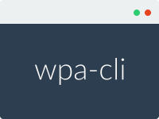

# Wordpress Admin CLI



NPM command-line utility to administer Wordpress installations.

The idea of it is to not fiddle with wordpres versions  / updates, just focus on writing your code. This should be easy to integrate in either a `npm script` or a runner `task` (`gulp`, `grunt`).

At the moment it only features an update function, which will get your installation to the latest stable version, but the plan is to also install, change versions, deploy your wordpress files with ease.

Check the [roadmap](readme.md#roadmap--todo) for more information.

## How to use

Install it, either locally:
```
npm install --save wpa-cli
```
or globally:
```
npm install --global wpa-cli
```
Run it with the `--path` option to give it the location of your wordpress install.

*Example (assuming your installation is located in the wordpress subfolder):*
```
wpa-cli --path wordpress/
```

Another usual use case is to create a `npm script` which will call it directly (`package.json`):
```
"scripts": {
  "update": "wpa-cli --path wordpress/"
},
```

## Under the hood

This relies on the [Wordpress organization's Github](https://github.com/WordPress) [Wordpress project repository](https://github.com/WordPress/WordPress) for all it's actions.

It takes it's versions from the [published tags](https://api.github.com/repos/Wordpress/Wordpress/tags), and the files from the releases tarballs.

This is kind of a risky move because if [Github](https://github.com) goes down this app will not be able to function anymore.

### Warning

The way the update works, is to overwrite the default files with the new version (just like the Wordpress engine with `wp-update-core.php`), so if you made modifications the engine, if you run the update, **they will be overwritten**

### Needs initial instalation

Since it's only function at the moment is update, it still need an initial instalation of Wordpress. This will be changed in the future as more functionality is added.

Check the [roadmap](readme.md#roadmap--todo) for more information.

## Known issues

If something doesn't work as you expect, look over the [known issues](https://github.com/rdig/wpa-cli/issues?q=label%3Aknown-issue) to see if it wasn't already reported, and fix/patch discovered.

## CLI

wpa-cli has few options, but it's wise to know about them. By default no options are passed.

The `-p` / `--path` option is required, if it's called without it, the app will exit with an error.

- `-p`, `--path <PATH>` The path where your local Wordpress installation resides
- `-k`, `--no-color` Omit color from output
- `--debug` Show debug information
- `-v`, `--version` Display the current version
- `-h`, `--help` Display help and usage details

## Name change

You may have known this app as `wordpress-update-cli` but since the feature scope change it was renamed to reflect this.

## Roadmap / Todo

- [ ] Install a new wordpress instance #1
- [ ] Deploy a new database #2
- [ ] Generate a `wp-config.php` file #3
- [ ] Set file / folders permissions #4
- [ ] Update external plugins #5
- [ ] Git commit after update #6
- [ ] Change current installation version #7
- [ ] Change the current installed plugin(s) version(s) #8
- [ ] Programatic API #9
- [x] ~~Update the local wordpress install to the latest version #10~~

## Contributing

**We welcome contributors to the the project.**

Please take a look at [contributing.md](contributing.md) on how to get started.

## License

This project is licensed under the MIT license. You can [read it here](./license.md) or learn more [about it here](http://choosealicense.com/licenses/mit/).

### Additional licenses

This project makes use of additional libraries and packages, each with it's own license and copyright.
